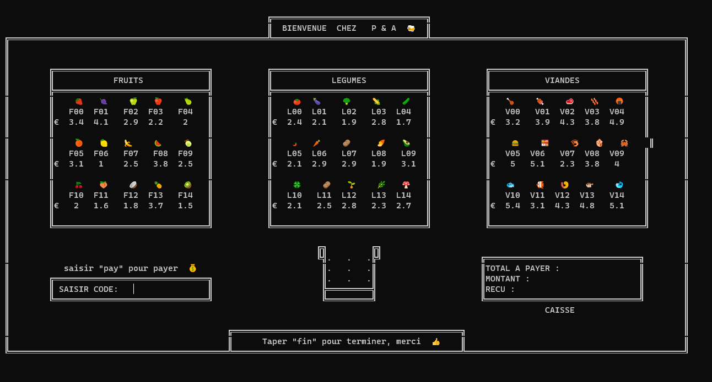

# GROCERY SHOP

Projet 1A-S1 ESIEA réalisé par @Jayllyz & @Pierrick444

Projet simple qui permet d’acheter des Fruits, Légumes ou Viandes grâce à un code lié à chaque article dans un terminal Linux.
